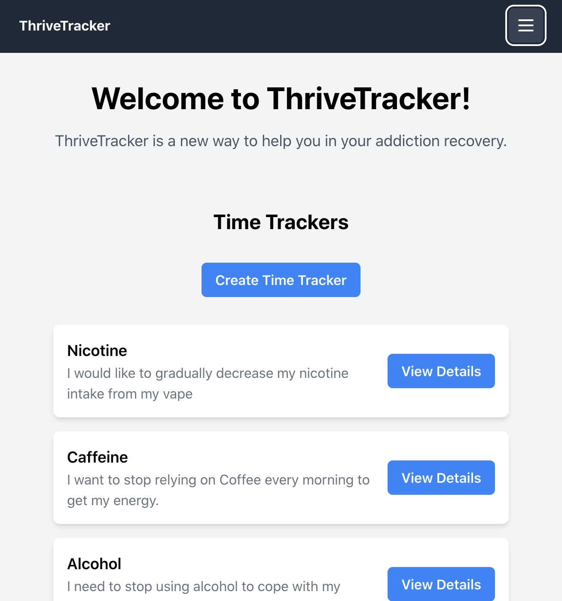

# Welcome to ThriveTracker!

## Take a look
[Thrivetracker has not yet been deployed](https://www.clappisonvet.com/wp-content/uploads/sites/222/2022/02/hang-in-there-baby.png)  
[Trello Board](https://trello.com/b/WLRA6mGl/project-4-capstone)

# ThriveTracker Backend
The backend of ThriveTracker is built using Django, a popular Python web framework. Django provides the foundation for the server-side functionality of the application, including handling HTTP requests and responses, managing authentication and authorization (in development), and interacting with databases.

## Features
The backend of ThriveTracker is responsible for handling various functionalities, including:

- Authentication (in development): ThriveTracker uses the Django REST framework's built-in authentication system along with JWT authentication to securely authenticate and authorize users.
- Serialization: Django REST framework provides serialization for converting complex data types, such as Django models, into JSON format that can be easily consumed by the frontend.
- Middleware: The backend uses middleware to add security features such as CSRF protection and CORS headers.
- API Endpoints: The backend defines API endpoints that the frontend interacts with to perform CRUD (Create, Read, Update, Delete) operations on the data stored in the application's database.

## Technologies Used
The following technologies were used in the development of ThriveTracker:

### Frontend
- React, a JavaScript library for building user interfaces.
- React Router DOM, a routing library for React applications.
- Tailwind CSS, a popular CSS framework for building responsive UIs.
- Axios, a promise-based HTTP client for the browser and Node.js.

### Backend
- Django, a high-level Python web framework for building robust and scalable web applications.
- Django REST framework, a powerful and flexible toolkit for building Web APIs.
- Django CORS Headers, a middleware that enables Cross-Origin Resource Sharing (CORS) in Django applications, allowing the frontend and backend to communicate with each other.
- Django Rest Framework Simple JWT, an extension for Django REST framework that provides JSON Web Token (JWT) authentication.

## Getting Started
To get started with the ThriveTracker backend, follow these steps:

- Clone the repository to your local machine.
Navigate to the directory where the backend code is located, typically named thrivetracker_django.
- Install the required dependencies by running pip install -r requirements.txt in your command line.
- Configure the Django settings in the settings.py file, including setting the SECRET_KEY, DEBUG, and ALLOWED_HOSTS variables.
- Run the Django development server by running python manage.py runserver in your command line.
The backend API will now be accessible at http://localhost:8000/ by default.

## Future Updates
ThriveTracker is an ongoing project, and there are more features planned for the future, such as:

- Adding the ability to add notes to the time tracker to help users stay on track.
- Calculating and displaying the savings from not using the addiction to motivate users.
- Implementing reminders and notifications to help users stay accountable.
- Adding more customization options for time trackers, such as setting goals and milestones.

## Contribution Guidelines
Contributions to the ThriveTracker backend are welcome! If you would like to contribute, please follow these guidelines:

- Fork the repository and create a new branch for your feature or bug fix.
- Make your changes and test thoroughly.
- Create a pull request with a detailed description of your changes.
- Ensure that your code follows the project's coding standards and is well-documented.
- Your contribution will be reviewed by the project maintainers, and any feedback will be provided for necessary changes.

## About Me 
**Duncan Wood** 
 
[LinkedIn](https://www.linkedin.com/in/duncanwoodpro/) |
[Github](https://github.com/Duncan-Wood)
 

## Check Out The Frontend!
To see the code for the frontend of Thrivetracker, visit the following link: 
[ThriveTracker Frontend](https://github.com/Duncan-Wood/ThriveTracker-Frontend)